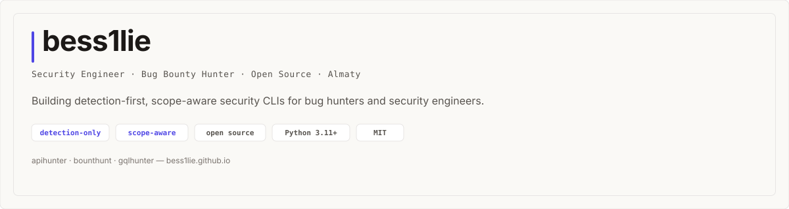

<picture>
  <source media="(prefers-color-scheme: dark)" srcset="assets/banner-dark.svg">
  
</picture>

---

  
  

---

## 🛠️ Tools

| | |
|---|---|
| 🔍 **[apihunter](https://github.com/bess1lie/apihunter)** `NEW` _REST API Security Testing CLI_ OpenAPI discovery · Heuristic scanning (IDOR, CORS) · Auth auditing | 🎯 **[bounthunt](https://github.com/bess1lie/bounthunt)** _Scope-Aware Bug Bounty Orchestrator_ Subfinder/nuclei orchestration · YAML scope guard · Checkpoint/resume |
| 🚀 **[gqlhunter](https://github.com/bess1lie/gqlhunter)** _GraphQL Recon & Analysis CLI_ Introspection · Field fuzzing · Schema diff · IDOR detection · Dashboard |  |

---

## 💻 Stack

---

## 📊 Stats

  <picture>
    <source media="(prefers-color-scheme: dark)" srcset="https://github-readme-stats-eight-theta.vercel.app/api?username=bess1lie&show_icons=true&include_all_commits=true&count_private=true&hide_title=true&hide_border=true&theme=dark&bg_color=0d1117&border_color=30363d&title_color=4F46E5&text_color=c9d1d9&icon_color=4F46E5">
    
  </picture>
  <picture>
    <source media="(prefers-color-scheme: dark)" srcset="https://github-readme-stats-eight-theta.vercel.app/api/top-langs/?username=bess1lie&layout=compact&hide_title=true&hide_border=true&theme=dark&bg_color=0d1117&border_color=30363d&title_color=4F46E5&text_color=c9d1d9&langs_count=6">
    
  </picture>
   
  <picture>
    <source media="(prefers-color-scheme: dark)" srcset="https://github-readme-streak-stats.herokuapp.com/?user=bess1lie&hide_border=true&theme=dark&background=0d1117&ring=4F46E5&fire=4F46E5&currStreakNum=c9d1d9&sideNums=58a6ff&currStreakLabel=4F46E5&sideLabels=8b949e&dates=6e7681">
    
  </picture>

---

## 🧠 Philosophy

| | |
|---|---|
| 🔍 | **Detection only, never exploitation** — recon and analysis, never payloads |
| 🛡 | **Scope-aware** — every action gated by YAML scope file |
| 📂 | **Open formats** — SQLite, Markdown, HTML, JSON, SARIF 2.1.0 |
| 💚 | **Open source** — MIT licensed, community-driven, contributions welcome |

---

## 🔗 Connect

  <a href="https://bess1lie.github.io"><code>site</code></a>
  &nbsp;&middot;&nbsp;
  <a href="https://github.com/bess1lie/apihunter"><code>apihunter</code></a>
  &nbsp;&middot;&nbsp;
  <a href="https://github.com/bess1lie/bounthunt"><code>bounthunt</code></a>
  &nbsp;&middot;&nbsp;
  <a href="https://github.com/bess1lie/gqlhunter"><code>gqlhunter</code></a>

---

  MIT licensed · detection-only security tooling
   
  ✦ built with Python · designed for security engineers ✦

